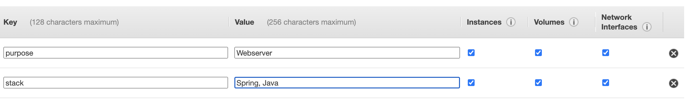
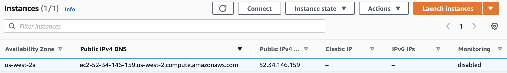

IntelliJ IDEA Python Development
-------------

# How to develop code for this Project
## This project was developed using IntelliJ IDEA with Python Plugin.  Following are tool requirements.

    Install IntelliJ IDEA  [Download](https://www.jetbrains.com/idea/)
    Install Python [Download](https://www.python.org/downloads/release/python-390/)
    Install Git [Download](https://git-scm.com/downloads) </li>
    Run IntelliJ, on main screen "Configure" search for and install Python Plugin
    Returning to main screen "Get from Version Control" the URL of this Github project
    To start web service look for run symbol in wsgi.py
    Dependencies are in requirements.txt
    Imports are in views.py and typically a hover of any red underlined object will enable import


Flask/Python Webserver Deployment
-------------

# How to initially deploy a Production Web Site on Raspberry Pi or Ubuntu
```diff
+ As a biginner this should take approximately 1 hour, just 15 minutes as you acquire experience  
```
## Visual overview: [Visuals of Deployment](https://padlet.com/jmortensen7/flaskdeploy)
## References used: [Digital Ocean article](https://www.digitalocean.com/community/tutorials/how-to-serve-flask-applications-with-gunicorn-and-nginx-on-ubuntu-18-04)

## An application is typically written using a developer-friendly framework, this project is using Flask. The application code does not care about anything except being able to process single requests.  Thus, when we scale up to the Web we add small services to handle problems that are the same across most web applications.  A Python Web Server Gateway Interface (WSGI) is a way to make sure that web servers and python web applications can talk to each other. So somewhere inside your application (usually a wsgi.py file) an object is defined which can be invoked by Gunicorn (app).

## Gunicorn takes care of everything which happens in-between the web server and a the Flask web application. This way, when coding up a Flask application we don’t need to find your own solutions for:
<ol>
  <li>Communicating with multiple web servers</li>
  <li>Reacting to lots of web requests at once and distributing the load</li>
  <li>Keepiung multiple processes of the web application running</li>
</ol>

## Nginx is the web server:  it accepts requests, takes care of general domain logic and takes care of handling https connections. Only requests which are meant to arrive at the application are passed on toward the application server (Gunicorn) and the application itself (Flask). 

## Setup Virtual environment and clone code from GitHub
#### In console/terminal (first time only: setup environment)...

pi@raspberrypi:~ $  ``` sudo apt update; sudo apt upgrade```

pi@raspberrypi:~ $  ``` sudo apt install python3-pip nginx```

pi@raspberrypi:~ $  ``` sudo pip3 install virtualenv```

pi@raspberrypi:~ $  ``` cd ~; git clone https://github.com/nighthawkcoders/flask-idea-homesite```

pi@raspberrypi:~ $  ``` cd ~/flask-idea-homesite; virtualenv -p `which python3` homesite; source homesite/bin/activate```

#### In console/terminal with virtualenv activitate (first time only: test for python3)...

(homesite) pi@raspberrypi:~ $  ``` python -V```

(homesite) pi@raspberrypi:~ $  ``` deactivate```

(homesite) pi@raspberrypi:~ $  ``` cd```


### Build Gunicorn configuration file.  Interesting bits...
<ol>
<li> 'ExecStart' start statement looks into wsgi:app (wsgi.py) and starts localhost:8080 as defined in file. </li>
<li> 'ExecStart' -workers 3 starts thread processes that are listening for connections, this ties into load balancing. </li>
</ol>
#### In console/terminal with nano, vi, or other text editor (first time only: setup Gunicorn configuration file)...

pi@raspberrypi:~ $  ``` sudo nano /etc/systemd/system/homesite.service```

    [Unit]
    Description=Gunicorn instance to serve homesite web project
    After=network.target

    [Service]
    User=pi
    Group=www-data
    WorkingDirectory=/home/pi/flask-idea-homesite
    Environment="PATH=/home/pi/flask-idea-homesite/homesite/bin"
    ExecStart=/home/pi/flask-idea-homesite/homesite/bin/gunicorn --workers 3 --bind unix:homesite.sock -m 007 wsgi:app

    [Install]
    WantedBy=multi-user.target

### Build Nginx configuration file.  Requirements [Internet Domain](https://docs.google.com/document/d/1nODveWp0jBzj4ZpFLgWCWTOXzLAHAPUhAQYmZJ4LhyU/edit), Host IP address, [Internet IP address](http://127.0.0.1:8080/pi/portforward).
<ol>
  <li> Obtain your own 'server_name' values; these VALUES WILL NOT WORK for your environment</li>
  <li> 'listen' is the port for nginx, this port will be used when you port forward </li>
  <li> 'proxy_pass' is passing connect along to gunicorn server </li>
</ol>

```diff
- THESE server_name values MUST CHANGE to match your solution:  
- nighthawkcoders.cf 192.168.1.245 70.95.179.231
+ REPLACE with yourdomain.com yourpi-ip yourpublic-ip
```
#### In console/terminal with nano, vi, or other text editor (first time only: setup Nginx configuration file)...

pi@raspberrypi:~ $  ``` sudo nano /etc/nginx/sites-available/homesite```

    server {
        listen 80;
        server_name nighthawkcoders.cf 192.168.1.245 70.95.179.231;

        location / {
            include proxy_params;
            proxy_pass http://unix:/home/pi/flask-idea-homesite/homesite.sock;
        }
    }


## Pull code from Github and update packages
#### In console/terminal (every update: pull code and check package dependencies)...

pi@raspberrypi:~ $  ``` cd ~/flask-idea-homesite```

pi@raspberrypi:~/flask-idea-homesite $ ```  git pull```

pi@raspberrypi:~/flask-idea-homesite $ ```  source homesite/bin/activate```

#### In console/terminal with virtualenv activitate (every time: check and update packages)...

(homesite) pi@raspberrypi:~/flask-idea-homesite $ ```  sudo pip install -r requirements.txt```


## Start Flask test Server and verify
#### Start an application test server, same as we do on development machine

(homesite) pi@raspberrypi:~/flask-idea-homesite $ ``` python wsgi.py ``` 

in your browser ...

http://localhost:8080/ 

stop test server by typing control-c in terminal

(homesite) pi@raspberrypi:~/flask-idea-homesite $ ``` ^c ``` 


## Prepare for Gunicorn usage and verify
#### In console/terminal test Gunicorn test Server and virify (first time only: gunicor exectuion)...

(homesite) pi@raspberrypi:~/flask-idea-homesite $ ```homesite/bin/gunicorn --bind 0.0.0.0:8080 wsgi:app```

in your browser ...

http://localhost:8080/ 

(homesite) pi@raspberrypi:~/flask-idea-homesite $ ``` ^c ``` 


## Validate Gunicorn configuration file and enable service permanently
#### In console/terminal start Gunicorn

pi@raspberrypi:~ $ ```sudo systemctl start homesite.service```

pi@raspberrypi:~ $ ```sudo systemctl enable homesite.service```
 
check the status...

pi@raspberrypi:~ $ ```sudo systemctl status homesite.service```

stop status by typing q in terminal


## Validate Nginx configuration file and enable service permanently
#### In console/terminal start Nginx

link file...

pi@raspberrypi:~ $ ```sudo ln -s /etc/nginx/sites-available/homesite /etc/nginx/sites-enabled```

test for errors...

pi@raspberrypi:~ $ ```sudo nginx -t```

start the web server...

pi@raspberrypi:~ $ ```sudo systemctl restart nginx```

check nginx status...

pi@raspberrypi:~ $ ```sudo systemctl status nginx```

stop status by typing q in terminal

in address bar of browser on another device in LAN type IP address of this Nginx server ...

```diff
- This IP address MUST CHANGE to match your Raspberry Pi 
+ REPLACE with yourpi-ip
```
http://192.168.1.245/

reboot to verify Nginx server config is permanent ...

next task is port forward Nginx server via public IP address on the internet ...


Flask/Python Webserver Update (aka Refresh)
-------------

# How to update Production Web Site on Raspberry Pi after initial setup
```diff
+ 5 minutes to do an update; if you have good branch managment this could be auto sceduled with crontab  
```
## Pull code from Github and update packages
#### In console/terminal (every update: pull code and check package dependencies)...

pi@raspberrypi:~ $  ``` sudo apt update; sudo apt upgrade```

pi@raspberrypi:~ $  ``` cd ~/flask-idea-homesite```

pi@raspberrypi:~/flask-idea-homesite $ ```  git pull```

pi@raspberrypi:~/flask-idea-homesite $ ```  source homesite/bin/activate```

#### In console/terminal with virtualenv activitate (every time: check and update packages)...

(homesite) pi@raspberrypi:~/flask-idea-homesite $ ```  sudo pip install -r requirements.txt```

#### In console/terminal (every time AFTER initial setup: restart gunicorn)...

pi@raspberrypi:~ $ ```sudo systemctl restart  homesite.service```


Raspberry Pi Purchase
-------------

# Instruction on purchasing a Raspberry Pi and preparing for Webserver deployment
Raspberry Pi 4 specification
<OL> 
<li> Raspberry Pi 4 4GB Model B with 1.5GHz 64-bit quad-core CPU (4GB RAM) </li>
<li> 32GB Samsung EVO+ Micro SD Card (Class 10) Pre-loaded with NOOBS, USB MicroSD Card Reader </li>
<li> Raspberry Pi 4 Case </li>
<li> 3.5A USB-C Raspberry Pi 4 Power Supply (US Plug) with Noise Filter</li>
<li> Set of Heat Sinks </li>
<li> Micro HDMI to HDMI Cable - 6 foot (Supports up to 4K 60p) </li>
<li> USB-C PiSwitch (On/Off Power Switch for Raspberry Pi 4) </li>
</OL> 

Purchase Notes:  Keyboard, Mouse, Monitor are optional.  RPi advantages over AWS: 1. One time cost  2. All kinds of tinker projects in IOT realm can be performed using GPIO pins.  As for purchase options, CanaKit (my prefered) has options on Amazon that meet the bulleted list of requirements. There is a new option on raspberrypi.org that describes RPi as built into a keybaord (could be bulky in my use cases).

Webserver deployment preparation: RPi with NOOBS installed on SSD is very simple.  At boot select Raspberry Pi OS and you are on your way.  Since this will be private IP host on your home network, Port Forwarding is required to make your website visible on the Internet.

Runtime Notes: Mostly I use VNC Viewer to connect to the RPi.  This is a full desktop remote display tool.  RealVNC lets you share full desktop with cohorts.  If you reboot RPi, you need a monitor connected at reboot to maintain VNC screen share functionality.  Reboot will cause screen buffer not to be recognized unless HDMI is present.  There may be a dummy (mini) HDMI plug that could overcomee this issue.  Otherwise, after setup your RPi could be headless.


AWS EC2 Setup
-------------

# Instruction on preparing AWS EC2 instance for Webserver deployment
Login into your AWS IAM user, search for EC2.

To get started, launch an Amazon EC2 instance, which is a virtual server in the cloud.


## Step 1: Choose an Amazon Machine Image (AMI)Cancel and Exit
An AMI is a template that contains the software configuration (operating system, application server, and applications) required to launch your instance. Pick Ubuntu free tier operating system that uses the Linux kernel.  Note, this is very compatible Raspberry Pi's OS.


## Step 2: Choose an Instance Type
Amazon EC2 provides a wide selection of instance types optimized to fit different use cases. Instances have varying combinations of CPU, memory, storage, and networking capacity.   Stick with Free Tier options, as of this writing t2.mico with free tier designation is suggested.

## No action on Steps #3 through #4
Step 3: Configure Instance Details
Stick with default.  Your will launch a single instance of the AMI by using defaults

Step 4: Add Storage
Stick with default.  Your instance will be launched with 8gb of storage.

## Step 5: Add Tags
Tag your Amazon EC2 resources.  This is not required but you could name your volume for future identification.



## Step 6: Configure Security Group
A security group is a set of firewall rules that control the traffic for your instance. On this page, you can add rules to allow specific traffic to reach your instance. In this example, a web server is setup to allow Internet traffic to reach EC2 instance, this allows unrestricted access to the HTTP and HTTPS ports.  Also, this example restricts SSH from my IP.


## Step 7: Review Instance Launch
Review your instance launch details. Click Launch to assign a key pair to your instance and complete the launch process.


## Before you leave your ADMIN session on AWS go to EC2 running instances and find your IPV4 address.



# Start a terminal session on you localhost.


MacOS and AWS Ubuntu
-------------

## MacOS SSH (secure shell) and FTP (file transfer protocol) to your EC2 Ubuntu machine

### MacOS login into the EC2 instance using SSH

Manage your PEM file, rename and move to SSH configuration directory, setting permission on my PEM file to protect it:

MacBook-Pro-2:~ johnmortensen$ ``` sudo mv ~/Downloads/ec2ubuntu.pem ~/.ssh/ec2ubuntu.pem ```

MacBook-Pro-2:~ johnmortensen$ ``` sudo chmod 400 .ssh/ec2ubuntu.pem ```

SSH command

MacBook-Pro-2:~ johnmortensen$ ``` sudo ssh -i ~/.ssh/ec2ubuntu.pem ubuntu@52.34.146.159 ```

This should lead you to a NEW terminal prompt on ubuntu:

ubuntu@ip-172-31-30-21:~$

### Move JAR file to your deployment host with sftp (secure file transfer protocol).  This procedure shows a file from MacOS to Ubuntu on AWS.  

MacBook-Pro-2:~ ``` sftp -i ~/.ssh/ec2spring.pem ubuntu@52.34.146.159 ```

Connected to ubuntu@52.34.146.159.

sftp> ``` put serving-web-content-0.0.1-SNAPSHOT.jar ```

Uploading serving-web-content-0.0.1-SNAPSHOT.jar to /home/ubuntu/serving-web-content-0.0.1-SNAPSHOT.jar

serving-web-content-0.0.1-SNAPSHOT.jar        100%   18MB   1.8MB/s   00:09  

## Window puTTY (popular SSH and telnet client) and SCP (secure copy) to your EC2 Ubuntu machine


Windows and AWS Ubuntu
-------------

### Windoss login into ECW using SSH using puTTY
To SSH on a windows machine you will need to use [puTTY](https://www.chiark.greenend.org.uk/~sgtatham/putty/latest.html). (Download correct bit installer and keep default settings).

Add your EC2 instance ip into the putTTY IP bar and keep the port set as 22 (The standard SSH port)


Open the puTTYgen app, (not puTTY), select "RSA: at the bottom and then click "load". Choose the .pem file downloaded from AWS earlier. Click "save private key" and click yes if you get a warning. Save this new .ppk file safely.


In the navigation bar at the left, expand "SSH" and select "Auth". Under "private Key File for authentication" click browse change the setting to search for all files and select the .pem file downloaded from AWS in the previous step. Click Open to start the connection, if you get a warning message just click yes. Log in as "ec2-user". Now you have access to the ubuntu machine.


### If you are using windows you can transfer files from your computer to your AWS ubuntu machine using [WinSCP](https://winscp.net/eng/index.php). Download and install the version for your computer. Once the program opens, click the "New Session" button. Put your IPV4 address in the hostname box and "ubuntu" as the username.

Download and install the version for your computer. Once the program opens, click the "New Session" button. Put your IPV4 address in the hostname box and "ubuntu" as the username.


To load your private key click "Advanced" then open the "SSH" dropdown and choose "Authentication". Choose your private key here...


Then click "Login" to start the SFTP server connection. Your files will be on the left and your virtual machines files will be on the right. Drag your JAR file from your desktop into the your ubuntu machine.


